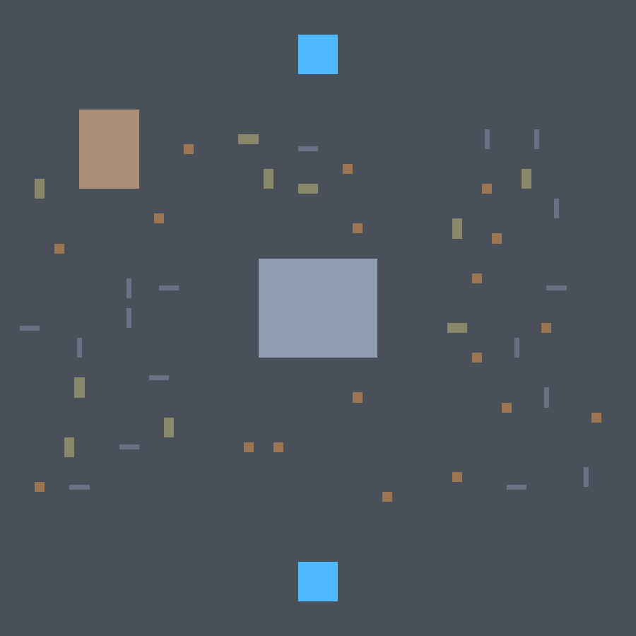
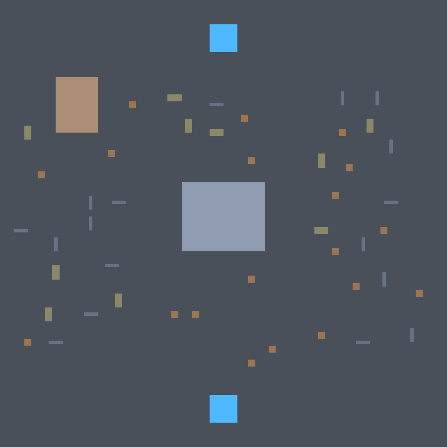
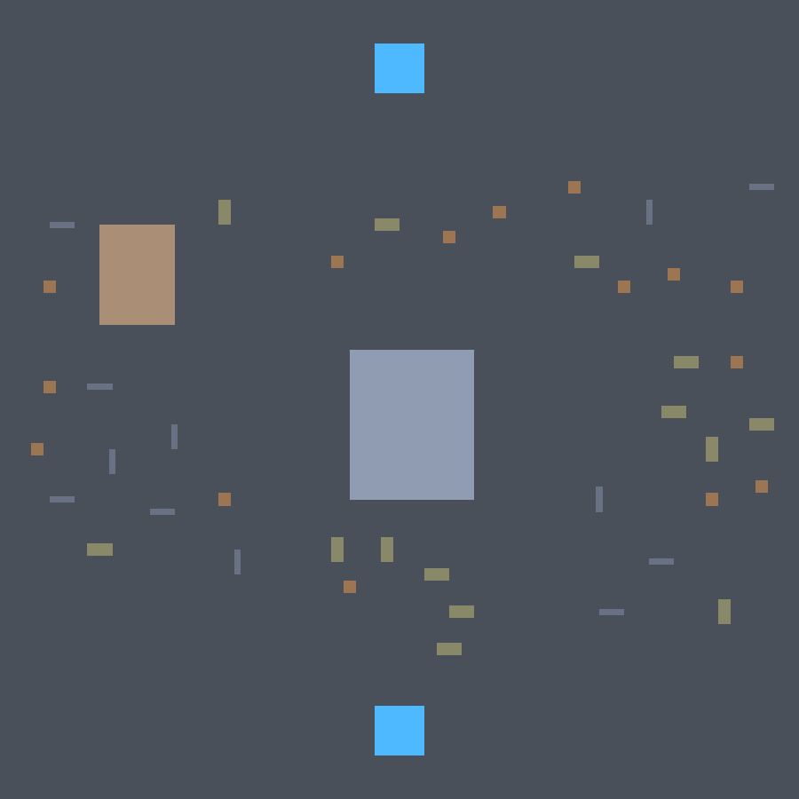
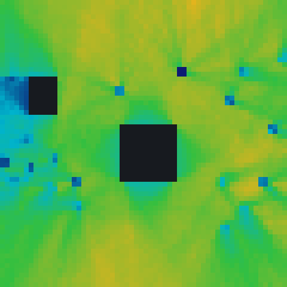
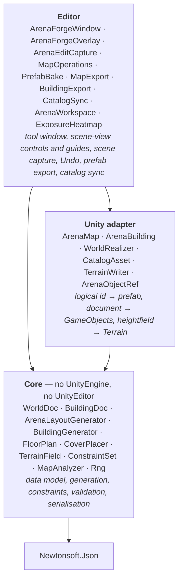
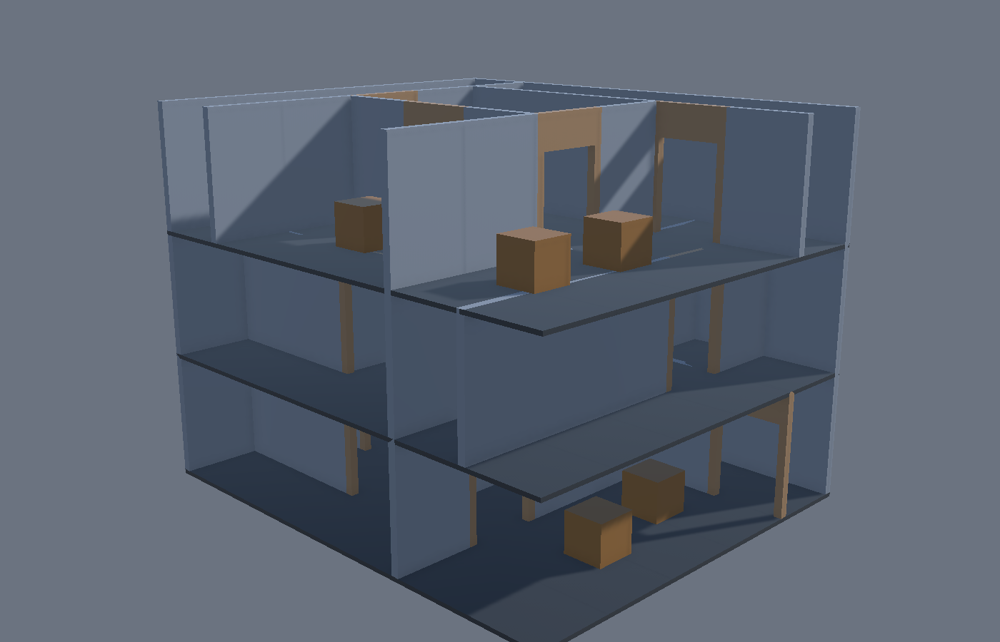
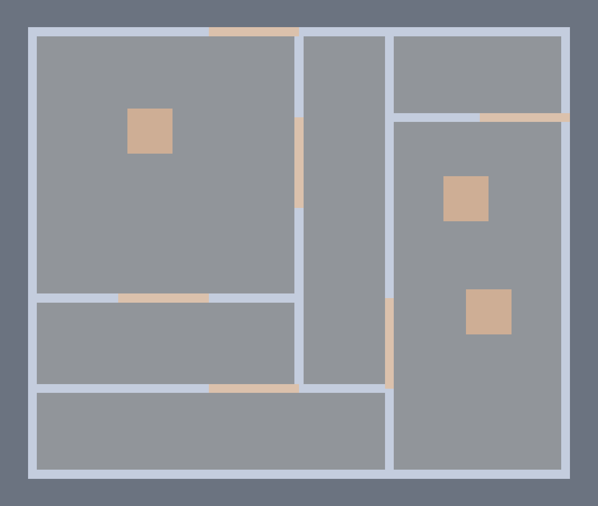

# ArenaForge

<!-- Replace this row with docs/loop.gif once recorded — see docs/loop.md for the four steps. -->

| Generate | Move one crate | Regenerate on a new seed |
|:--:|:--:|:--:|
|  |  |  |

*Everything moved except the crate that was moved by hand.*

ArenaForge is a Unity editor tool that procedurally generates small Call-of-Duty-style arena maps —
about 60 × 60 metres, a two-storey building anchoring the middle, a structure anchoring each flank, a
stone fence round the outside, scattered cover and two opposing spawns. How much is built on follows
how much ground there is, so the same settings on a 400 × 400 m playfield come out a town of three
dozen buildings at the same density. The
problem it solves is the one that kills most procedural level tools in practice: the moment a
designer hand-edits the output, the generator becomes a one-shot scene initialiser, because
regenerating would throw the edits away. Here a map is not a saved scene — it is a seed, a set of
parameters, and a list of manual edits stored as a diff on top. Move a crate, change the cover
density, regenerate, and the crate stays where you put it. It also measures what it built:
sightlines, cover coverage, spawn fairness and connectivity, each against a threshold, so a
generated map can be judged rather than just looked at.

## The map, and how it plays

| Top-down | Exposure |
|:--:|:--:|
|  |  |

The same map, rendered and measured. On the right, cold blue is ground almost nobody can see and
hot yellow is ground seen from everywhere; dark cells are the floor a structure stands on. The
shadows fanning out from each barrier are its sightline cover. Exposure is computed in pure C# by
segment-versus-rectangle intersection — no physics, no colliders, no loaded scene.

## Architecture



Dependencies point one way only, and the Core boundary is compiler-enforced rather than a
convention: `ArenaForge.Core.asmdef` sets `"noEngineReferences": true`, so a `using UnityEngine;` in
Core is a build error. It also sets `"overrideReferences": true` with Newtonsoft as its only
precompiled reference, so Core cannot quietly acquire a second dependency either.

`ARCHITECTURE.md` is the longer version. `REPORT.md` explains every metric and where its threshold
came from.

## Design decisions

**Why a seed plus overrides rather than a saved scene.** Saving the generated scene throws away the
generator the moment a human touches the output: changing a parameter means regenerating from
scratch and losing every hand edit, so in practice people stop regenerating after the first manual
pass. Keeping the seed and parameters authoritative, with edits as a separate diff layer, means
regeneration stays cheap for the whole life of the map. The cost is real and worth naming — an
override refers to something the generator produced, and the generator can stop producing it. Those
orphans are returned from `Resolve()` in a separate list and surfaced in the window with explicit
keep and discard actions. Silently discarding a user's edit is the one failure mode that would make
the tool untrustworthy, so the design refuses to make that call on the user's behalf.

**Why logical asset ids and tag queries rather than Unity GUIDs.** Core refers to art as
`cover/low/crate_wood_01` plus tags, and never sees a prefab or a GUID. GUIDs were rejected for
three reasons: they are meaningless in a diff, so a world document becomes unreviewable; they break
when the art pack is reimported or swapped, which for a tool built around a third-party asset pack
is routine rather than an edge case; and they would drag an engine concept into Core, collapsing the
boundary. The generator asks for *a piece of low cover about a metre wide*, not for a specific
crate, so selection is a tag query — require-all, require-any, exclude — weighted by each entry's
weight. Stable ids follow the same logic: `map/lane_mid/cover_03` is a readable generation path, not
a hash, because a hash changes when anything about the object changes, which is precisely wrong for
something whose job is to keep pointing at the same object across regenerations.

**Why generation is runtime code rather than editor-only.** Everything that builds a map lives in
`Runtime/`, and `ArenaMap.Generate()` works in a build. Putting it in an editor assembly would have
made it untestable outside the editor loop, unusable at runtime, and would have implied a dependency
on `UnityEditor` reaching down into the generator. The editor assembly holds the *tool* — the
window, the scene capture, the Undo grouping — and nothing that decides where a crate goes.

**Why Core has no engine reference, and how it is enforced.** So that generation and analysis are
testable without an engine, without a scene, and without the editor loop. That is not an abstract
virtue: it is what makes a thousand-seed property suite affordable, and it is why the line-of-sight
test is segment-versus-rectangle arithmetic rather than `Physics.Raycast`. Enforcement is the
`noEngineReferences` flag, plus a test that asserts the Core assembly's referenced assemblies
contain no `UnityEngine`. Portability to another engine is a *consequence* of the boundary, not the
goal — there is no second adapter and no plan for one.

**What the property-based tests actually assert, and why that matters here.** A procedural system
has no fixed expected output, so example-based tests can only ever check the one map you thought
to write down. Instead the suite generates seeds 1..1000 and asserts invariants that must hold for
every map: spawn B is reachable on foot from spawn A, every declared structure doorway is
reachable, the reachable fraction of the walkable floor is above threshold, exposure asymmetry
between the two spawns is below threshold, and cover coverage is above threshold. Others assert
that no two committed footprints overlap and that nothing blocks a doorway, over 200 seeds. Failures
report the worst-scoring seeds by number, so a bad map can be regenerated by hand and looked at.
Every threshold was set from the measured spread across those thousand seeds and then given
headroom — the reasoning for each is in `REPORT.md`, including the two that moved from their first
guesses and why.

**Why the edit capture only runs while the tool window is open.** Capture mutates the user's
document. A global editor hook doing that quietly in every scene that happens to contain a map is a
worse bargain than a tool that only watches while it is on screen. It also records an edit once the
dragged object comes to rest rather than on every tick, so one gesture makes one override and one
undo step, and it collapses its undo group back to before the gesture began so Unity's own
transform entry and the document change come back together on a single Ctrl+Z.

## Install

Unity 6 (6000.0 or newer). In **Window → Package Manager → + → Install package from git URL**:

```
https://github.com/pinchasVaknin/ArenaForge.git?path=/Packages/com.pinchasvaknin.arenaforge
```

The `?path=` suffix is required — the package lives in a subfolder of the repo, not at its root.
The only dependency is `com.unity.nuget.newtonsoft-json`, which resolves automatically.

To run the tests, add the package to `testables` in `Packages/manifest.json`:

```json
"testables": [ "com.pinchasvaknin.arenaforge" ]
```

## Quick start

1. **Import the sample.** Package Manager → ArenaForge → Samples → **Arena Demo → Import**. It needs
   the Universal Render Pipeline and the Input System, which the tool itself does not.
2. Open `Assets/Samples/ArenaForge/0.1.0/Arena Demo/DemoArena.unity`.
3. **Window → ArenaForge → Arena Forge.** The window binds to the `ArenaForge Demo Map` object.
4. Press **Generate**. The validation panel fills in with seven metrics and the exposure heatmap
   appears; tick *Draw in scene view* to see it over the ground.
5. Drag a crate in the scene view. The override count goes to 1.
6. Press **↻** beside the seed, then **Regenerate (keep edits)**. Everything moves except your
   crate. Ctrl+Z walks the whole thing back.
7. The same seed and re-roll, the map size, Generate, Regenerate, Clear, Save world…, Load world…
   and Export to prefab… are all in the scene view itself, in the **ArenaForge** overlay — with the
   tool window closed as well as open. Tick *Layout guides* to draw the playfield, the lane bands
   and the two spawns; change the map size or the lane count and they follow without regenerating,
   so you can see what the next generation will use before committing to it.

### Generating a building

| Three storeys, near walls cut away | The ground floor's plan |
|:--:|:--:|
|  |  |

1. Add an **ArenaForge → Arena Building** component to an empty object and point its `World
   Realizer` at the same catalog.
2. In the overlay, switch to **Item**. Set the footprint, the floors and the floor height, and press
   **Generate**.
3. Press **↻** beside *Floor 2*. Only floor 2 changes — the other floors are not re-generated, they
   are not touched. Each floor stores its own seed, so the ones you did not re-roll serialise to the
   bytes they already had.
4. Press **Export to prefab…**. It writes a prefab and adds a catalog row under
   `structure/building/` with the building's footprint and its floors' height.
5. Switch back to **Map** and press **Generate**. The arena generator places the exported building
   like any other structure — the map generator did not change to accommodate it, because a building
   reaches it through the catalog and nothing else.

Each storey is divided by binary space partition into rooms and corridors, with a wall on every cut
and one module of it taken out as a doorway — so a floor is connected by construction rather than by
a reachability pass. The shell is built from whatever the catalog binds to `structure/floor`,
`structure/wall`, `structure/doorway`, `structure/stairs` and `structure/parapet`; a catalog with
none of them still builds, and the storey comes back as one undivided room. Contents are then placed
inside the rooms, corridors are left clear, and nothing is dropped in a doorway.

The storeys are joined by a stairwell that stands in the same place on every floor, with the slab
above it opened up so you can actually go up — including through the roof, which is capped with a
final slab and fenced with a parapet round its edge. The shaft is picked once for the whole building,
so re-rolling a floor rearranges its rooms around the stairs rather than moving them. Rooms are then
furnished three times: anything tagged `propbuilding/decor/centerpieces` stood in the middle as the room's
centrepiece, cover scattered across what is left of the floor, and anything tagged `prop/decor` or
`propbuilding/decor/decoration` put into the corners, one piece per corner.

An exported building is a leaf: baked art, no longer re-rollable by floor. The `ArenaBuilding` stays
the editable source, and re-exporting over the same path is how a change reaches the prefab. The
same is true of **Export to prefab…** in the **Map** tab, which bakes a finished map — after its
hand edits — into a prefab with no ArenaForge components left in it, for a project that does not
have the package. `docs/building.md` reads all four frames.

### Using your own art

**Tools → ArenaForge → Setup Complete Workspace.** One click does the three things a project needs
before it can generate anything of its own.

It makes `Assets/ArenaWorkspace` — somewhere to work that updating the package will not overwrite,
which the imported sample is not:

```
Assets/ArenaWorkspace/
├── Buildings/                     exported buildings, read back as structure/building
├── Catalog/                       ArenaCatalog, pointed at the root
├── Meshes/                        raw art: the meshes and materials the prefabs are made of
└── Props/
    ├── Covers/
    │   ├── Low/                   cover/low  — what you crouch behind
    │   └── High/                  cover/high — what you stand behind
    ├── Houses/                    structure/house
    ├── Spawns/                    spawn
    ├── fence/
    │   ├── StoneFence/            the boundary round the edge of the map
    │   └── WoodFence/             the fence round a house's yard
    └── PropBuilding/
        ├── Doorways/              structure/doorway
        ├── Floors/                structure/floor
        ├── Parapets/              structure/parapet
        ├── Stairs/                structure/stairs
        ├── Walls/                 structure/wall
        ├── Windows/               structure/window
        └── Decor/
            ├── Decoration/        what stands in a room's corners
            ├── Corners/           furniture modelled as a corner — an L-shaped sofa
            ├── Centerpieces/      what stands in the middle of a room
            ├── InteriorCovers/    what is scattered over a room's floor
            └── OutDecor/
                ├── ContinueAround/  tiled end to end round a building's walls
                └── UniqueGroup/     heaped in clusters against them
```

**A folder here says where the generator may put a prop, not what the prop is.** That is why the tree
is as deep as it is, and why two different folders are both called `Covers`: `Props/Covers` is
tactical cover a firefight is fought around, and `PropBuilding/Decor/Centerpieces` is what goes in the
middle of a room. A sideboard filed in with the first would be shot over.

`Props/Covers` is two deep for the same kind of reason: the cover placer queries `cover/low` and
`cover/high` separately, so a workspace that stopped at `Covers` would file every crate under a tag
it never asks for and generate an arena with no cover in it. `Props/fence` splits the same way, and
the two halves never mix: `StoneFence` is what the world boundary is tiled from and `WoodFence` is
what a yard is fenced with. A garden panel spliced into the wall round the world reads as a hole
somebody patched, so a workspace with nothing in `StoneFence` gets no boundary rather than a boundary
made of the wrong art.

`Decor/Corners` is for furniture modelled *as* a corner — an L-shaped sofa, with a back along negative
Z and a second back along negative X. It belongs in a true geometric corner and in exactly one of the
four turns there, and nothing filed in it is ever scattered across a floor.

Then it files the demo art into it. The sample the Package Manager copies is one flat folder of
prefabs and materials, and on the first day it is the only art you have — so each prefab is moved
into the folder that names its tag, and the materials and meshes they are built from go to `Meshes`
so the prop folders hold nothing but props. Moving keeps every asset's GUID, so the demo scene and
`DemoCatalog` follow it rather than breaking.

Then it writes four starter prefabs, art you can build from before you have any: a 1 × 3 m
staircase that climbs a whole storey, a metre of roof fence, a 1 m floor tile, and a wall module
with a window in the upper half of it. The first three are modelled on a metre grid on purpose — a
metre floor tile lets a 1 × 3 m flight cut exactly a 1 × 3 m hole rather than rounding up to a
coarser one, and a metre of fence divides a roof of metre tiles so the parapet closes at the
corners. The window is the exception: nothing lays it out, it is swapped into a module a wall run
was already tiled with, so what it has to match is the wall — 2 × 2.9 m, which is what the demo
pack's wall measures. Note the trade the floor tile makes: it is 0.2 m thick, so a 3 m storey has
2.8 m of headroom, and wall art taller than that is not offered to a floor at all.

Every step is idempotent, so run it again whenever you are not sure whether you ran it — and do run
it again after re-importing the sample, which puts a fresh copy of the demo art back where it
started. Art it cannot file, because you renamed it or because the workspace already has something
of that name, is left where it is and reported in the console; nothing is overwritten.

Drop prefabs into the folders and press **Sync from Folders** on the catalog. Tags come from the
folder names, so a crate in `Props/Covers/Low` comes back tagged `cover` and `cover/low` — exactly
what the cover placer queries for — and the footprint and height are read off the prefab's box
collider. A folder name the sync does not recognise becomes its own tag, so `Covers/Low/Wooden`
works without the tool having heard of wood; a recognised one starts the tag afresh, so an
organising folder above it does not end up in every tag underneath.

The sync adds and updates and never deletes: a row for an exported building or one you bound by
hand stays, and so do the weights and sockets you typed in. You can still author a
**ArenaForge → Catalog** asset row by row instead — the sync writes the same rows the inspector
does.

**Marking a doorway.** A house is placed by its footprint, and nothing about a mesh says which wall
the front door is in — so a map used to assume the middle of two faces and keep the ground clear
there, which is a clearance in front of a blank wall and a stack of crates against the actual door.
Put a child called `DoorwayMarker` in the prefab where each way in is: a box collider on it declares
the threshold, an empty transform declares a metre square, and either way the marker is left out of
the piece's own measurements. Two doorways are used per structure, far apart; a prefab that declares
three keeps the two furthest from each other.

### Merging a group into one prefab

Arrange a desk, a monitor and a chair in a scene, select them, and press **Tools → ArenaForge →
Merge to Prefab** — or pick the same entry from the hierarchy's right-click menu. They are parented
under a new empty at the average of their pivots, saved as a prefab in a workspace folder
(`Decor/Centerpieces` by default, `Decor/InteriorCovers` beside it, or anywhere you type), and the
catalog row is written for you.

The row is the one **Sync from Folders** would have written for the same prefab, so pressing it
afterwards finds the group and changes nothing. What the tool saves is the four steps, not a new kind
of art: what comes out is an ordinary prefab in an ordinary folder.

### Terrain

Set **Terrain relief** in the tool window and give the map a Unity `Terrain` on its `Arena Map`
component. The generator gives the playfield an organic heightfield and everything on the map takes
its height from it, and `TerrainWriter` hands the heights to the terrain to draw.

Structures do not follow the ground — they level it. Each one cuts and fills a flat pad under its
footprint plus a metre of doorstep, with a four-metre apron grading back into the hillside, so a
building is never on a slant. Both spawn areas are levelled the same way, so neither team gets to
look down at the other from a rise.

Relief defaults to **0**, which is a flat map exactly as before. That is deliberate: the heightfield
decides where objects stand, not what the ground looks like — this tool composes prefabs and does
not author a mesh — so turning relief up without a terrain to draw it would leave your props
following ground nothing renders.

## Known limits, and what I would do next

- **The analysis is two-dimensional.** Occluders are rectangles with a vertical span, and exposure
  is sampled at one eye height on the ground. A two-storey building blocks sightlines through it;
  nobody stands on its upper floor. Doing this properly needs walkable *surfaces* rather than a
  walkable grid. The building generator does not change this: a placed building is still one
  footprint and one occluder, so every metric is a claim about the ground floor.
- **A stairwell is one shaft, in one place, at one width.** `PlanStairwell` picks one rectangle for
  the whole building and every storey works around it, which is what makes the flights line up. What
  it cannot do is turn: a switchback, or a second flight at the far end of a long building, would
  need the shaft to be a per-storey decision again — and re-rolling one floor would then move the
  stairs on all the others.
- **The opening in a slab is a whole number of floor tiles.** It is anchored on a slab joint and cut
  to the fewest tiles the flight can be made to need, with the flight flush in its low corner rather
  than adrift in the middle — but a one-metre flight under a two-metre tile still opens two metres of
  floor. Trimming a tile would mean authoring a mesh, which this tool does not do; a half-tile in the
  catalog closes the rest from the art side.
- **Nothing checks that a flight actually lands.** The generator assumes a `structure/stairs` entry
  rises across its own footprint to its own declared height, so a half-flight, or art that rises the
  other way, is placed exactly as confidently. Which end is the top is a fact about the mesh that
  Core cannot read — which is also why no doorway may open into the shaft at all, when a door onto
  the landing is what a person would draw.
- **The slab and the walls can disagree about where a room ends.** A wall run is tiled from a
  catalog piece at its declared size and never stretched, and the slab tiles on its own footprint —
  so an art pack whose floor tile is not as wide as its wall is long leaves the slab joints out of
  step with the walls and a strip of bare ground at the edge of the storey. Squaring the two
  automatically would mean scaling a prefab, which this tool does not do.
- **The analysis does not know about the terrain.** Exposure and connectivity are measured as though
  every point of the map were at one height, so with relief turned up a sightline reported as clear
  may run through a rise. Making exposure terrain-aware is affordable; making connectivity
  terrain-aware means deciding how steep a slope a player can climb, which is a game design decision
  this tool should not make on its own.
- **A wall has to be shorter than its storey.** The slab has a thickness and the storey pitch has to
  hold both, so a catalog whose wall art is as tall as the floor height gets a building with no walls
  — quietly, as a catalog with no wall art does. The art in the box is 2.9 m of wall on a 0.2 m tile,
  which is what the default 3.1 m storey is sized for; type a floor height under that and the
  building comes back as bare slabs.
- **The playfield is a rectangle divided into parallel lane bands.** This is the limitation I would
  fix first, because that symmetry is what makes different seeds feel more alike than they look. It
  needs lanes to become a described route graph rather than a band subdivision.
- **`SwapAsset` is one object at a time.** The overlay swaps the selected object for another
  catalog entry carrying the same tags; swapping a whole selection at once is not there.
- **Edit capture is editor-only and window-scoped.** Deleting a realised object with the window
  closed goes unrecorded, and it returns on the next regeneration.
- **Regeneration rebuilds every GameObject** rather than diffing the resolved list against the
  scene. Fast enough at this size; the wrong shape for a much larger map.
- **The art is placeholder primitives.** No third-party assets are committed — the sample ships
  cubes with URP materials, and the catalog is designed to be repointed at a real pack without
  touching a single world document.

`FUTURE.md` has the longer list, including the scope that was considered and deliberately rejected.

## Licence

MIT — see [LICENSE](LICENSE).
