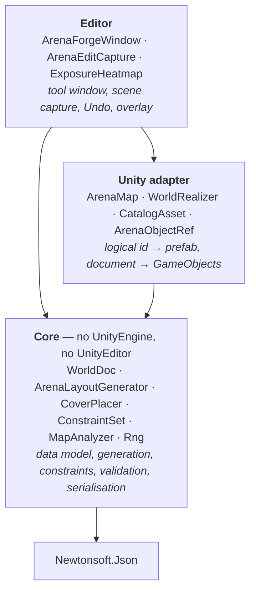

# ArenaForge

<!-- Replace this row with docs/loop.gif once recorded — see docs/loop.md for the four steps. -->

| Generate | Move one crate | Regenerate on a new seed |
|:--:|:--:|:--:|
|  |  |  |

*Everything moved except the crate that was moved by hand.*

ArenaForge is a Unity editor tool that procedurally generates small Call-of-Duty-style arena maps —
about 60 × 60 metres, a two-storey building, a house, scattered cover and two opposing spawns. The
problem it solves is the one that kills most procedural level tools in practice: the moment a
designer hand-edits the output, the generator becomes a one-shot scene initialiser, because
regenerating would throw the edits away. Here a map is not a saved scene — it is a seed, a set of
parameters, and a list of manual edits stored as a diff on top. Move a crate, change the cover
density, regenerate, and the crate stays where you put it. It also measures what it built:
sightlines, cover coverage, spawn fairness and connectivity, each against a threshold, so a
generated map can be judged rather than just looked at.

## The map, and how it plays

| Top-down | Exposure |
|:--:|:--:|
|  |  |

The same map, rendered and measured. On the right, cold blue is ground almost nobody can see and
hot yellow is ground seen from everywhere; dark cells are the floor a structure stands on. The
shadows fanning out from each barrier are its sightline cover. Exposure is computed in pure C# by
segment-versus-rectangle intersection — no physics, no colliders, no loaded scene.

## Architecture



Dependencies point one way only, and the Core boundary is compiler-enforced rather than a
convention: `ArenaForge.Core.asmdef` sets `"noEngineReferences": true`, so a `using UnityEngine;` in
Core is a build error. It also sets `"overrideReferences": true` with Newtonsoft as its only
precompiled reference, so Core cannot quietly acquire a second dependency either.

`ARCHITECTURE.md` is the longer version. `REPORT.md` explains every metric and where its threshold
came from.

## Design decisions

**Why a seed plus overrides rather than a saved scene.** Saving the generated scene throws away the
generator the moment a human touches the output: changing a parameter means regenerating from
scratch and losing every hand edit, so in practice people stop regenerating after the first manual
pass. Keeping the seed and parameters authoritative, with edits as a separate diff layer, means
regeneration stays cheap for the whole life of the map. The cost is real and worth naming — an
override refers to something the generator produced, and the generator can stop producing it. Those
orphans are returned from `Resolve()` in a separate list and surfaced in the window with explicit
keep and discard actions. Silently discarding a user's edit is the one failure mode that would make
the tool untrustworthy, so the design refuses to make that call on the user's behalf.

**Why logical asset ids and tag queries rather than Unity GUIDs.** Core refers to art as
`cover/low/crate_wood_01` plus tags, and never sees a prefab or a GUID. GUIDs were rejected for
three reasons: they are meaningless in a diff, so a world document becomes unreviewable; they break
when the art pack is reimported or swapped, which for a tool built around a third-party asset pack
is routine rather than an edge case; and they would drag an engine concept into Core, collapsing the
boundary. The generator asks for *a piece of low cover about a metre wide*, not for a specific
crate, so selection is a tag query — require-all, require-any, exclude — weighted by each entry's
weight. Stable ids follow the same logic: `map/lane_mid/cover_03` is a readable generation path, not
a hash, because a hash changes when anything about the object changes, which is precisely wrong for
something whose job is to keep pointing at the same object across regenerations.

**Why generation is runtime code rather than editor-only.** Everything that builds a map lives in
`Runtime/`, and `ArenaMap.Generate()` works in a build. Putting it in an editor assembly would have
made it untestable outside the editor loop, unusable at runtime, and would have implied a dependency
on `UnityEditor` reaching down into the generator. The editor assembly holds the *tool* — the
window, the scene capture, the Undo grouping — and nothing that decides where a crate goes.

**Why Core has no engine reference, and how it is enforced.** So that generation and analysis are
testable without an engine, without a scene, and without the editor loop. That is not an abstract
virtue: it is what makes a thousand-seed property suite affordable, and it is why the line-of-sight
test is segment-versus-rectangle arithmetic rather than `Physics.Raycast`. Enforcement is the
`noEngineReferences` flag, plus a test that asserts the Core assembly's referenced assemblies
contain no `UnityEngine`. Portability to another engine is a *consequence* of the boundary, not the
goal — there is no second adapter and no plan for one.

**What the property-based tests actually assert, and why that matters here.** A procedural system
has no fixed expected output, so example-based tests can only ever check the one map you thought
to write down. Instead the suite generates seeds 1..1000 and asserts invariants that must hold for
every map: spawn B is reachable on foot from spawn A, every declared structure doorway is
reachable, the reachable fraction of the walkable floor is above threshold, exposure asymmetry
between the two spawns is below threshold, and cover coverage is above threshold. Others assert
that no two committed footprints overlap and that nothing blocks a doorway, over 200 seeds. Failures
report the worst-scoring seeds by number, so a bad map can be regenerated by hand and looked at.
Every threshold was set from the measured spread across those thousand seeds and then given
headroom — the reasoning for each is in `REPORT.md`, including the two that moved from their first
guesses and why.

**Why the edit capture only runs while the tool window is open.** Capture mutates the user's
document. A global editor hook doing that quietly in every scene that happens to contain a map is a
worse bargain than a tool that only watches while it is on screen. It also records an edit once the
dragged object comes to rest rather than on every tick, so one gesture makes one override and one
undo step, and it collapses its undo group back to before the gesture began so Unity's own
transform entry and the document change come back together on a single Ctrl+Z.

## Install

Unity 6 (6000.0 or newer). In **Window → Package Manager → + → Install package from git URL**:

```
https://github.com/pinchasvaknin/ArenaForge.git?path=/Packages/com.pinchasvaknin.arenaforge
```

The `?path=` suffix is required — the package lives in a subfolder of the repo, not at its root.
The only dependency is `com.unity.nuget.newtonsoft-json`, which resolves automatically.

To run the tests, add the package to `testables` in `Packages/manifest.json`:

```json
"testables": [ "com.pinchasvaknin.arenaforge" ]
```

## Quick start

1. **Import the sample.** Package Manager → ArenaForge → Samples → **Arena Demo → Import**. It needs
   the Universal Render Pipeline and the Input System, which the tool itself does not.
2. Open `Assets/Samples/ArenaForge/0.1.0/Arena Demo/DemoArena.unity`.
3. **Window → ArenaForge → Arena Forge.** The window binds to the `ArenaForge Demo Map` object.
4. Press **Generate**. The validation panel fills in with seven metrics and the exposure heatmap
   appears; tick *Draw in scene view* to see it over the ground.
5. Drag a crate in the scene view. The override count goes to 1.
6. Press **↻** beside the seed, then **Regenerate (keep edits)**. Everything moves except your
   crate. Ctrl+Z walks the whole thing back.

To use it on your own art, make a **ArenaForge → Catalog** asset, add a row per prefab with its
logical id, tags, footprint and height, and point a `World Realizer` at it.

## Known limits, and what I would do next

- **The analysis is two-dimensional.** Occluders are rectangles with a vertical span, and exposure
  is sampled at one eye height on the ground. A two-storey building blocks sightlines through it;
  nobody stands on its upper floor. Doing this properly needs walkable *surfaces* rather than a
  walkable grid.
- **The playfield is a rectangle divided into parallel lane bands.** This is the limitation I would
  fix first, because that symmetry is what makes different seeds feel more alike than they look. It
  needs lanes to become a described route graph rather than a band subdivision.
- **`SwapAsset` has no UI.** The override op exists and round-trips; nothing in the window produces
  one.
- **Edit capture is editor-only and window-scoped.** Deleting a realised object with the window
  closed goes unrecorded, and it returns on the next regeneration.
- **Regeneration rebuilds every GameObject** rather than diffing the resolved list against the
  scene. Fast enough at this size; the wrong shape for a much larger map.
- **The art is placeholder primitives.** No third-party assets are committed — the sample ships
  cubes with URP materials, and the catalog is designed to be repointed at a real pack without
  touching a single world document.

`FUTURE.md` has the longer list, including the scope that was considered and deliberately rejected.

## Licence

MIT — see [LICENSE](LICENSE).
